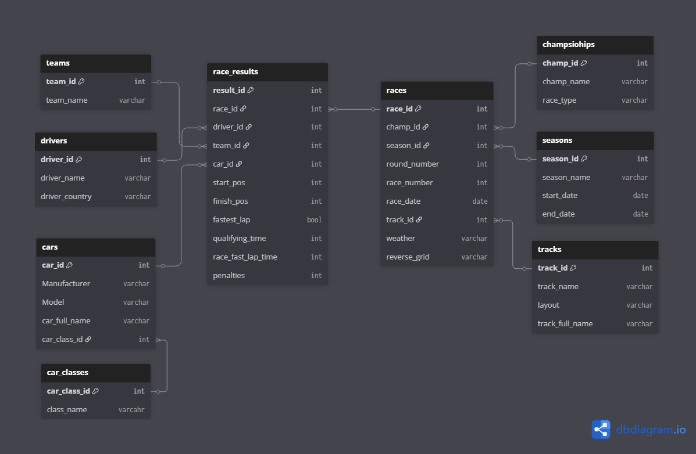

## Project Overview

This project involved transforming a single spreadsheet containing data from a racing series into a relational data model in Excel, before connecting the model to Power BI to produce an interactive leaderboard and driver statistics dashboard.

The project demonstrates my ability to take **raw, manually maintained data and turn it into a structured, analysis-ready dataset**, while applying principles of data modelling, data cleaning, relational database design, and business intelligence.

---

## Project Objectives

The main objectives of the project were to:

* Transform a single flat spreadsheet into a relational data model.
* Reduce duplicated and inconsistent data.
* Separate different types of information into logical tables.
* Establish relationships between the tables using unique identifiers.
* Create a reusable data structure that could be expanded as more races were added.
* Connect the structured Excel model to Power BI.
* Create an interactive racing leaderboard.
* Calculate and visualise driver statistics and performance metrics.
* Make the underlying data easier to maintain and analyse.

---

## The Original Data

The starting point was a **single spreadsheet containing all of the data**.

The original structure combined multiple types of information within the same table, including information such as:

* Drivers
* Teams
* Races
* Tracks
* Race results
* Championship points
* Qualifying results
* Race positions

While this structure was suitable for manually recording results, it was not ideal for analytical reporting.

### Example of the original structure

| **Date**   | **Season** | **Round** | **Race** | **Race Name** | **Race Type** | **Team Name** | **Track**            | **Driver**      | **Car**                     | **Car Class** | **Start Pos** | **Finish Pos** | **FL** | **Penalties** | **Points** | **Quali Points** | **FL Points** | **Deductions** | **Total Points** | **Pos +/-** | **Quali Time** | **Race Fast Lap** | **Weather** | **Reverse Grid** |
| ---------- | ---------- | --------- | -------- | ------------- | ------------- | ------------- | -------------------- | --------------- | --------------------------- | ------------- | ------------- | -------------- | ------ | ------------- | ---------- | ---------------- | ------------- | -------------- | ---------------- | ----------- | -------------- | ----------------- | ----------- | ---------------- |
| 28/11/2023 | Season 1   | Round 1   | Race 1   | GT3 Cup       | Individual    |               | Suzuka - Full Course | Alex Hoyle      | Mercedes - AMG GT3 16       | Gr.3          | 1             | 1              | FL     |               | 25         |                  | 2             | 0              | 27               | 0           |                |                   |             | No               |
| 28/11/2023 | Season 1   | Round 1   | Race 1   | GT3 Cup       | Individual    |               | Suzuka - Full Course | Conor Roberts   | Subaru - BRZ GT300 21       | Gr.3          | 4             | 4              |        |               | 12         |                  |               | 0              | 12               | 0           |                |                   |             | No               |
| 28/11/2023 | Season 1   | Round 1   | Race 1   | GT3 Cup       | Individual    |               | Suzuka - Full Course | Harry Richards  |                             | Gr.3          | DNS           | DNS            |        |               | 0          |                  |               | 0              | 0                | 0           |                |                   |             | No               |
| 28/11/2023 | Season 1   | Round 1   | Race 1   | GT3 Cup       | Individual    |               | Suzuka - Full Course | Joe McGhee      | Ferrari - 458 Italia GT3 13 | Gr.3          | 5             | 5              |        |               | 10         |                  |               | 0              | 10               | 0           |                |                   |             | No               |
| 28/11/2023 | Season 1   | Round 1   | Race 1   | GT3 Cup       | Individual    |               | Suzuka - Full Course | Lawrence Parker | McLaren - 650S GT3 15       | Gr.3          | 2             | 3              |        |               | 15         |                  |               | 0              | 15               | \-1         |                |                   |             | No               |

This approach resulted in information such as driver, team, car class, and track details being repeated across multiple rows.

---

# Data Transformation

## From Flat File to Relational Model

I redesigned the spreadsheet using a **relational data model**, separating the original dataset into multiple logical tables.

The model was designed around the principle of storing each type of information once and linking related records using unique IDs.

### New table structure

The final Excel model consisted of tables such as:

```text

```

---

## Data Model

The relational structure allowed entities such as drivers, teams, races and circuits to be stored independently while the results table acted as the central source of performance data.

For example:

This structure made it possible to analyse race results from different perspectives without repeatedly storing the same descriptive information.

---

# Data Cleaning & Preparation

During the transformation process, I carried out a number of data preparation tasks, including:

* Removing duplicated information.
* Standardising driver names.
* Standardising team and circuit names.
* Creating unique identifiers.
* Separating descriptive information from transactional race results.
* Ensuring consistent data types.
* Checking for missing or invalid values.
* Structuring the tables so they could be related reliably.
* Preparing the model for future race results.

### Example

Instead of repeatedly storing:

```text
Driver A | Team 1
Driver A | Team 1
Driver A | Team 1
Driver A | Team 1
```

the model stores the driver and team information once and references them using IDs.

This improves consistency and makes the dataset easier to maintain.

---

# Relational Design

One of the main improvements was moving away from a single flat table towards a relational structure.

### Before

### After


with relationships established through keys such as:
- driver_id
- team_id
- championship_id
- race_id
- track_id

This allowed the model to behave more like a small relational database while still being maintained within Excel.

---

# Power BI

Once the Excel model was structured, I connected it to **Power BI** to create an interactive reporting layer.

The Power BI model used the relationships established within the structured dataset to allow results to be analysed across different dimensions.

## Dashboard Features

The dashboard included functionality such as:

### Championship Leaderboard

A leaderboard showing drivers ranked according to their accumulated championship points.

Example:

| Position | Driver   | Points | Wins | Podiums |
| -------: | -------- | -----: | ---: | ------: |
|        1 | Driver A |    185 |    5 |       8 |
|        2 | Driver B |    164 |    4 |       7 |
|        3 | Driver C |    142 |    3 |       6 |

### Driver Statistics

Individual driver performance could be analysed using metrics such as:

* Total points
* Race starts
* Wins
* Podiums
* Average finishing position
* Best finishing position
* Average qualifying position
* Pole positions
* Points per race
* Number of DNFs

---

# Dashboard Visualisations

The Power BI report included visualisations such as:

* Championship leaderboard
* Driver points comparison
* Driver performance over time
* Race-by-race results
* Finishing position distribution
* Qualifying vs finishing position
* Wins and podiums
* Driver-level performance breakdowns

### Interactive Features

Users could filter the report by dimensions such as:

* Driver
* Team
* Race
* Round
* Circuit
* Season

This allowed the same underlying dataset to support multiple types of analysis.

---

# Power BI Measures

I also created calculated metrics within Power BI to turn the raw race results into meaningful performance statistics.

Example measures included:

```DAX

```

```DAX

```

```DAX

```

```DAX

```

---

# End-to-End Data Flow

The overall workflow was:

This created a complete workflow from **raw data collection through to business intelligence reporting**.

---

# Key Challenges

## Challenge 1 — Converting a Flat Dataset

The original spreadsheet was designed primarily for recording information rather than analysis.

I had to identify which fields represented separate entities and determine how they could be split into logical tables.

---

## Challenge 2 — Avoiding Duplicate Data

Driver, team, race and circuit information appeared repeatedly throughout the origina
